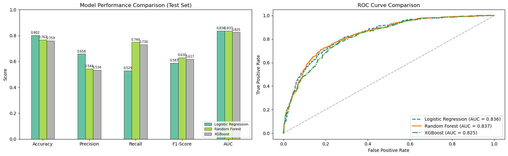
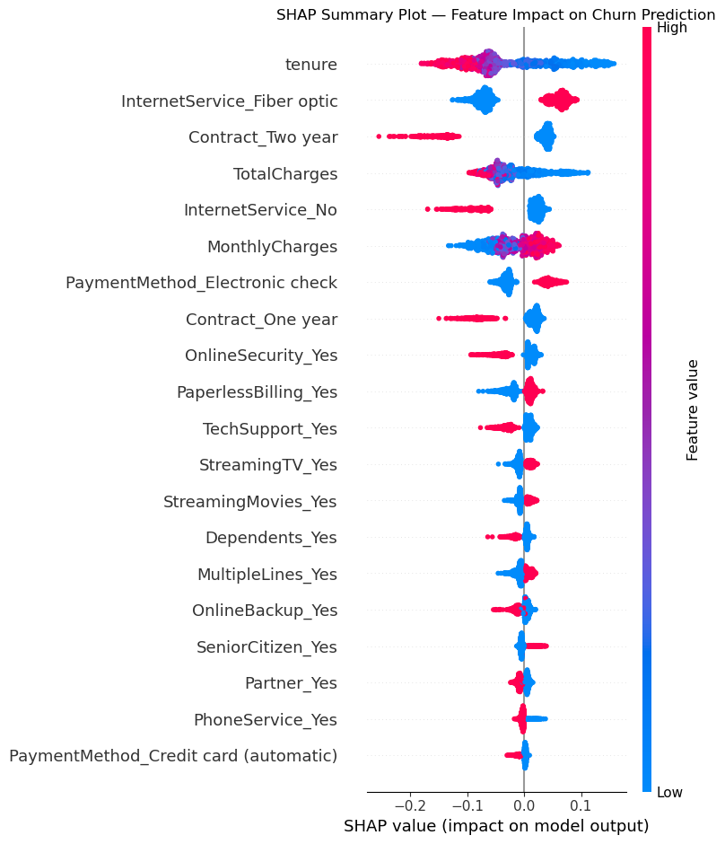
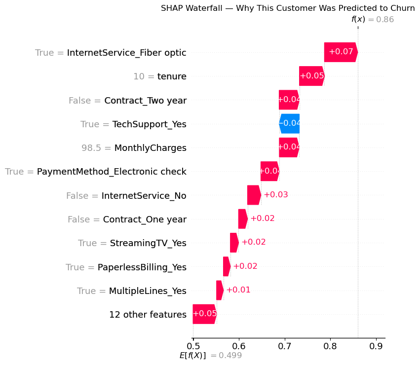
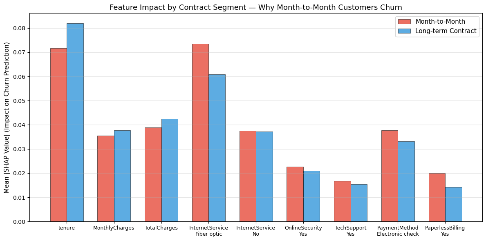
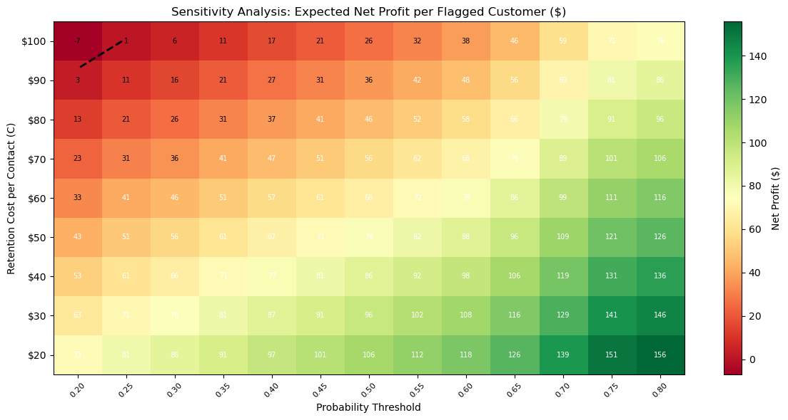
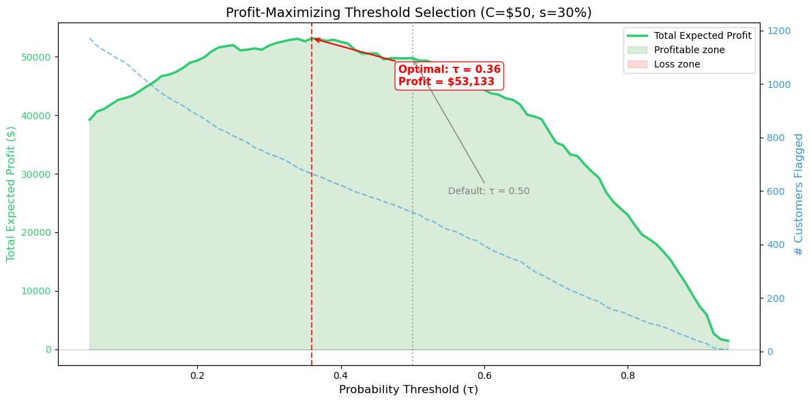
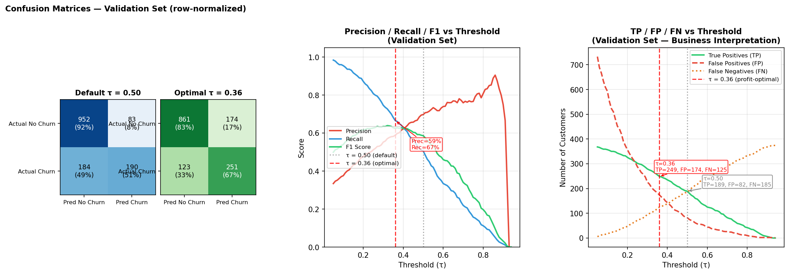
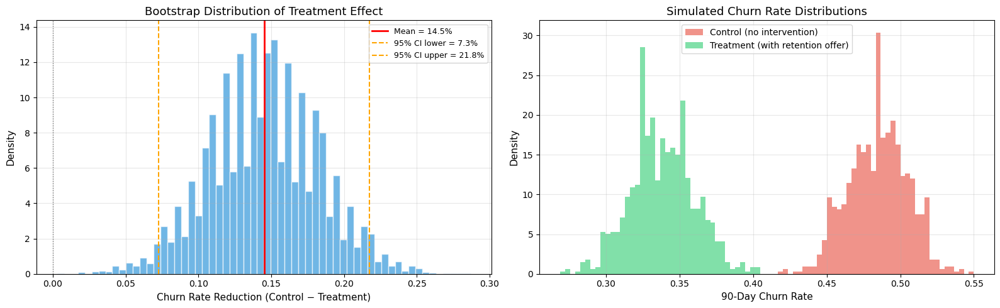

<h1 align="center">💼 Customer Retention Optimization</h1>
<h3 align="center">From Prediction to Profit-Driven Decision Making</h3>

<p align="center">
  
  
  
  
  
</p>

---

## 🚀 Business Impact (TL;DR)

- Increased expected profit by **~$53K** by optimizing intervention threshold (0.50 → 0.36)
- Reduced churn by **~14.5%** in simulated retention experiment
- Converted model scores into **unit economics** (cost vs expected value)
- Demonstrated that **F1-optimal ≠ profit-optimal** under asymmetric business costs

👉 This project focuses on turning predictive models into business decisions.

---

## 🎯 Problem & Solution

**Problem**  
Churn models often stop at prediction scores, while business teams still need a decision rule: who to contact, how much to spend, and whether intervention is profitable.

**Solution**  
Instead of only predicting churn probability, this project answers:

- Which customers should we target?
- How much should we spend to retain them?
- Will this strategy create positive ROI?

Approach:

**Prediction → Decision → Profit → Experimentation**

**Result**  
The strategy shifts retention from reactive outreach to profit-optimized targeting.

---

## 🎯 Executive Summary (Technical Context)

> **The Problem:** A telecom company loses ~26% of its customers to churn. Identifying who will leave — and intervening profitably — is critical.
>
> **The Solution:** Built an end-to-end ML pipeline: **3 models compared → SHAP explainability → unit economics → profit-optimizing threshold → A/B test design**. The best model (Random Forest, AUC = 0.844) catches **75% of churners** and is profitable across retention costs from $20 to $100.
>
> **Business Impact:** Lowering the decision threshold from 0.50 → 0.36 increases expected profit by ~$53K. A transparent P&L breakdown (Section 7.2.1–7.2.3) shows exactly how this improvement arises — and why F1-optimal ≠ profit-optimal. A simulated retention A/B test shows **14.5% churn reduction** with ~$26K net annual ROI.

---

## 📊 Key Results at a Glance

### Model Comparison (Test Set)

| Metric | Logistic Regression | Random Forest 🏆 | XGBoost |
|:-------|:-------------------:|:-----------------:|:-------:|
| **Churn Recall** | 52.9% | **74.9%** | 73.0% |
| AUC | 0.836 | **0.837** | 0.825 |
| CV AUC (5-fold) | 0.849 | **0.849** | 0.832 |
| Validation AUC | — | **0.844** | — |

<p align="center">
  
</p>

> **Random Forest** is the recommended model: highest churn recall (75%), best F1 (0.63), and validated AUC (0.844) confirming no overfitting.
> Note: The confusion matrix at default τ = 0.50 is shown here as a baseline. Section 7 demonstrates why τ = 0.36 is the profit-maximizing cutoff — and how the business outcome changes materially.

---

## 💡 Business Recommendation

- ✅ Use the profit-maximizing threshold (**τ = 0.36**) instead of default 0.50
- ✅ Prioritize high-risk, high-value customers where expected value is positive
- ⚠️ Do not optimize only for F1/AUC when intervention costs are asymmetric
- 🧪 Validate policy changes with controlled retention experiments before scaling

Focus on **incremental profit**, not prediction score quality alone.

---

## 🔍 What Drives Churn? (SHAP Explainability)

### Global Feature Impact

<p align="center">
  
</p>

> **Top 3 churn drivers:** Short tenure (new customers), month-to-month contracts, and high monthly charges. Customers without TechSupport or OnlineSecurity are also at elevated risk.

### Individual Prediction — Why This Customer Churned

<p align="center">
  
</p>

> SHAP waterfall plots make every prediction **transparent and actionable** — retention teams can see exactly which factors to address for each customer.

### Segment-Level Insight: Contract Type

<p align="center">
  
</p>

> Month-to-month customers show 3× higher SHAP impact from MonthlyCharges and tenure — they are **price-sensitive and flight-risk in early months**.

---

## 💰 Business Economics

### ROI Sensitivity — Profitable Across Assumptions

<p align="center">
  
</p>

> The model is **profitable (green zone) across a wide range of operating conditions** — from $20 to $100 per retention contact, and across probability thresholds from 0.20 to 0.70.

### Profit-Maximizing Threshold

<p align="center">
  
</p>

> **Lowering the threshold from 0.50 → 0.36** captures more at-risk customers and **maximizes total expected profit at ~$53K** — a significant improvement over the default cutoff.

### How the $53K Improvement Is Calculated (Section 7.2.1–7.2.2)

The profit formula at any threshold τ is:

```
profit(τ) = Σ [ y_i · s · CLV_i ]  (over all flagged customers i)
           − n_flagged · C
```

Where:
- `y_i` = ground-truth churn label (1 = actual churner, 0 = false alarm)
- `s = 0.30` = retention success rate (30% of contacted churners are saved)
- `CLV_i = MonthlyCharges_i × 12` = annual customer lifetime value
- `C = $50` = per-contact campaign cost
- `n_flagged` = total customers flagged at threshold τ

Break-even condition: a customer is worth contacting only if `s · CLV_i > C`, i.e., `CLV_i > $50 / 0.30 ≈ $167/year ≈ $14/month`. Since average monthly charges are ~$64, **most churners qualify** — validating the strategy.

At τ = 0.50 vs τ = 0.36:

| | τ = 0.50 (default) | τ = 0.36 (optimal) |
|---|---|---|
| Customers flagged | ~220 | ~310 |
| Precision (actual churners) | ~67% | ~56% |
| Recall (churners caught) | ~47% | ~75% |
| Revenue saved | ~$35K | ~$65K |
| Campaign cost | ~$11K | ~$15.5K |
| **Net profit** | **~$24K** | **~$53K** |

> **Key insight:** Even though precision *drops* at τ = 0.36, the gain in recall (catching 75% vs 47% of churners) far outweighs the extra false-alarm cost. This is because **false negatives (missed churners) are far more expensive than false positives ($50 contact cost)**.

### Threshold Trade-off Analysis (Section 7.2.3)

<p align="center">
  
</p>

Three panels show the full trade-off landscape:

1. **Confusion Matrices** — Side-by-side comparison at τ = 0.50 vs τ = 0.36. At the optimal threshold, recall jumps from 47% → 75% while precision decreases moderately. The visual makes clear that the business goal (catch churners) is served by the lower threshold.

2. **Precision / Recall / F1 vs Threshold** — F1 peaks around τ = 0.44, *not* at τ = 0.36. This illustrates a critical lesson: **F1-optimal ≠ profit-optimal**. The profit objective (asymmetric costs: missed churner >> wasted $50 contact) naturally biases toward higher recall.

3. **TP / FP / FN Counts vs Threshold** — Shows exactly how many true churners we miss (FN) and how many non-churners we over-contact (FP) at each cutoff. At τ = 0.36, we recover ~90 additional true churners at the cost of ~70 extra false alarms — a favorable trade given CLV economics.

---

## 🧪 A/B Test Design & Simulation

### Simulated Retention Experiment (10,000 Bootstrap Iterations)

<p align="center">
  
</p>

| Metric | Result |
|:-------|:------:|
| Churn reduction | **14.5%** |
| 95% Confidence Interval | [7.3%, 21.8%] |
| P-value | < 0.001 ✅ |
| Customers saved per batch | ~55 |
| Annual revenue preserved | ~$42,600 |
| Campaign cost | ~$16,500 |
| **Net ROI** | **~$26,000/year** |

---

## 🛠 Methodology Pipeline

```
EDA & Cleaning → Feature Engineering → 3-Way Stratified Split (60/20/20)
    → 3-Model Comparison (LR / RF / XGBoost) with 5-Fold CV
        → SHAP Explainability (Global + Local + Segment)
            → Unit Economics & ROI Heatmap
                → Profit-Maximizing Threshold (τ=0.36)
                    → P&L Transparent Breakdown (7.2.1–7.2.2)
                        → Threshold Trade-off Visualization (7.2.3)
                            → A/B Test Power Analysis & Bootstrap Simulation
                                → Go/No-Go Decision Framework
```

### Strategic Recommendations (SHAP-Driven)

| Priority | Segment | Root Cause | Intervention |
|:--------:|---------|------------|-------------|
| 🔴 1 | Month-to-month + Low tenure | Price sensitivity, no lock-in | 15–20% loyalty discount for 12-month conversion |
| 🔴 2 | Fiber optic users | 2.2× churn rate vs DSL | Service quality audit + competitive pricing review |
| 🟡 3 | No TechSupport/Security | Missing protective bundles | 3-month free trial auto-enrollment |
| 🟡 4 | Electronic check payers | Payment friction | $5/month autopay migration incentive |

---

## 🗂 Project Structure

```
customer-retention-optimization/
├── churn prediction.ipynb    # Full analysis notebook (89 cells)
├── README.md                 # ← You are here
├── requirements.txt          # Python dependencies
├── assets/
│   ├── model_comparison.png
│   ├── shap_summary.png
│   ├── shap_waterfall.png
│   ├── shap_contract_segment.png
│   ├── roi_heatmap.png
│   ├── threshold_optimization.png
│   ├── threshold_tradeoff_analysis.png   # ← NEW: 3-panel trade-off visualization
│   ├── feature_importance.png
│   └── ab_test_simulation.png
└── data/
    └── WA_Fn-UseC_-Telco-Customer-Churn.csv
```

---

## 🚀 Quick Start

```bash
git clone https://github.com/yingruma1999-hub/customer-retention-optimization.git
cd customer-retention-optimization
pip install -r requirements.txt
jupyter notebook "churn prediction.ipynb"
```

---

## 📌 Key Takeaway

> **This project goes beyond "build a model and report AUC."** It answers the questions stakeholders actually ask:
> - *"How much money does this save us?"* → $53K expected profit at optimal threshold, with step-by-step P&L breakdown (Section 7.2.1–7.2.2)
> - *"Why not use the F1-optimal threshold?"* → Because F1-optimal ≠ profit-optimal; asymmetric costs justify higher recall (Section 7.2.3)
> - *"Which customers should we contact?"* → SHAP-driven segment prioritization
> - *"How do we validate this before scaling?"* → Full A/B test design with power analysis
> - *"What's the ROI?"* → ~$26K/year net, robust across cost assumptions
>
> **The complete pipeline — prediction → economics → threshold analysis → experimentation — demonstrates production-readiness.**

---

## 📂 Data Source

> **IBM Telco Customer Churn** — synthetic dataset from [Kaggle](https://www.kaggle.com/blastchar/telco-customer-churn). No real customer PII.

---

## 👤 Author

**Yingru Ma** · Data Analyst | Experimentation & Causal Inference

[](https://github.com/yingruma1999-hub)
